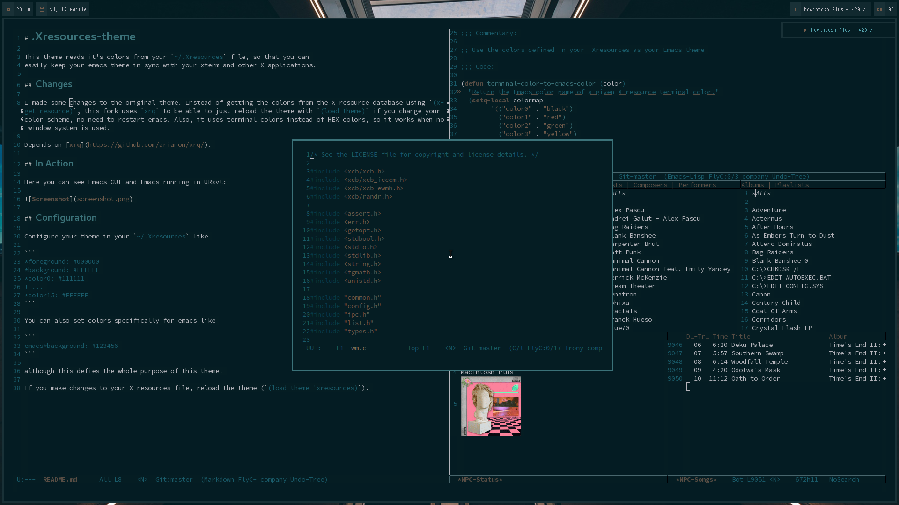

# .Xresources-theme

This theme reads it's colors from your `~/.Xresources` file, so that you can
easily keep your emacs theme in sync with your xterm and other X applications.

## Changes

I made some changes to the original theme. Instead of getting the colors from the X resource database using `(x-get-resource)`, this fork uses `xrq` to be able to just reload the theme with `(load-theme)` if you change your color scheme, no need to restart emacs. Also, it uses terminal colors instead of HEX colors, so it works when no window system is used.

Depends on [xrq](https://github.com/arianon/xrq/).

## In Action

Here you can see Emacs GUI and Emacs running in URxvt:



## Configuration

Configure your theme in your `~/.Xresources` like

```
*foreground: #000000
*background: #FFFFFF
*color0: #111111
! ...
*color15: #FFFFFF
```

You can also set colors specifically for emacs like

```
emacs*background: #123456
```

although this defies the whole purpose of this theme.

If you make changes to your X resources file, reload the theme (`(load-theme 'xresources)`).
